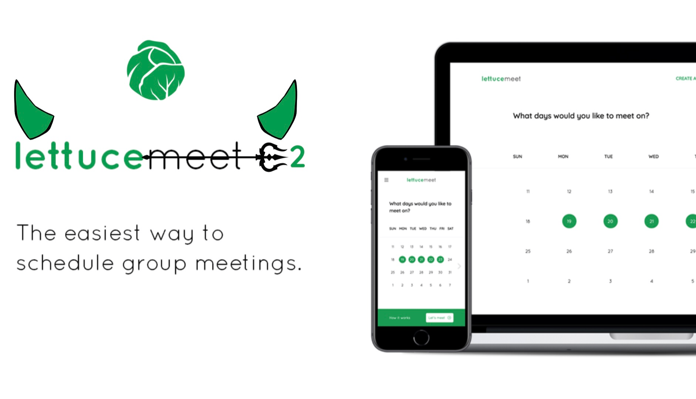
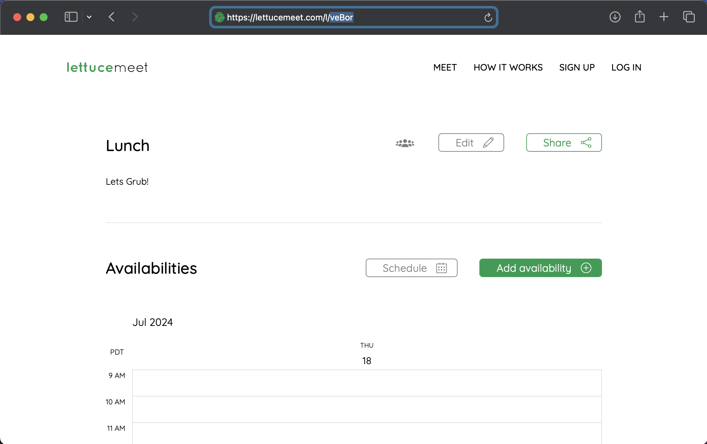

<div align="center">

  
  <h1>LettuceMeet C2</h1>
</div>
This is a PoC of a simple "C2-less" RAT (for Windows) using <a href="https://lettucemeet.com">LettuceMeet</a>, LettuceMeet is a web-based tool that allows an easy and efficient way to schedule meetings; with a nice UI and calendar for scheduling, folks can input their name or email, and times of availability with the corresponding day. LettuceMeet C2 takes advantage of this ease of scheduling, extracts the name value for the most recent "availability", and executes the command. The output is then encoded in base64, and sent back to your lettucemeet meeting by creating an "availability" with the name as the base64 encoded chunk(s) (char limit is 255). If the output is too large (4000+ chars), the output will be uploaded to Dropbox as a text file. All commands and responses are deleted after being received.

This is a "beta" version of the project, so I don't advice using such for Red Team Assessments unless comfortable with the logic and communication of the project. (With the disclaimer in mind)

# Why LettuceMeet? 🧐
LettuceMeet is a trusted websites used by countless universities, jobs, and other production/business environments. This allows traffic between the attacker and victim machine to be less suspiscious than to connect back to a standard C2 or other suspicious endpoints for command & control or exfiltration.

# Usage 🔫
```#ID [path segment]``` : Change LettuceMeet C2 on the fly with another lettucemeet "meeting".

```#Upload [filepath]``` : Upload file **from** victim machine to dropbox.

```#Download [url]``` : Download file from a url. (*saves file to name of file in the url*)

```#Auto``` : Puts this RAT to startup.

**Everything else is ran in powershell!**

## Send Commands
[Send-Commands](https://github.com/user-attachments/assets/f24c069b-6ff6-4bbf-8f23-ce58ef428579)

## Predefined Commands
[Default-Commands](https://github.com/user-attachments/assets/3043d26f-d339-475a-9022-5b9381acf9e0)

# Install 🚀
| Prerequisite | Version |
|--------------|---------|
| Go           |  <=1.22 |

```
git clone https://github.com/CharlesTheGreat77/LettuceMeetC2
cd LettuceMeetC2
git mod init LettuceMeet
go mod tidy
```

## Compile
Compiling your payload
```
go build -o lettucemeet.exe main.go
```

## Building Client
```
go build lettuceClient.go
./lettuceClient -h
```

# Setup ⚙️
Create a lettucemeet "meeting" for scheduling: 
1. Go to <a href="https://lettucemeet.com">LettuceMeet.com</a>
2. Select "Let's meet"
3. Create a name for the meet & description (name it anything)
4. Copy and paste the five character path segment in the url to **cmd/root.go** in the **Path** variable. *(ie: 7WWXS)*
 

Create a DropBox token for large output and file exfiltration:
1. Follow the steps for this DropBox oauth guide if unsure or do not have an existing token in use. <a href="https://lettucemeet.com">DropBox oauth guide</a>
2. Copy and paste your token to **cmd/root.go** in the **Whom** variable.

In **cmd/root.go** file:
```go
var (
	Path  = "" // path segment
	Whom  = "" // Dropbox token
	Where = "/files.txt" // where large output is uploaded
)
```

* Note: **output** uploaded to dropbox will be saved as files.txt, change as necessary. **Downloaded** files will be saved in the root folder with the corresponding filename.

# Client 🧪
I created a simple tool to decode the base64 encoded output when a target machine responds back.

```-id``` : refers to your path segmenet (lettucemeet path segment).

```-resp``` : specifying *-resp* will get the response from the **id** specified.

```-send``` : send a command to be executed on the target machine. *ie:* -send "Get-Process > output.txt"

```bash
Usage of ./lettuceClient:
  -h	show help message
  -id string
    	specify path segment (id) to LettuceMeet schedule
  -resp
    	receive and decode the response back (-id is required)
  -send string
    	sepcify a command to send [enclosed in quotes ideally] (-id is required)
```

# Limitations 
Due to the 255 char limit in the name value when inputting a "schedule", output will be saved to a *txt* file and sent to Dropbox. Additionally, one can **not** upload files to lettucemeet, so downloading files from the victim machine will be uploaded to dropbox as well.
* Note: I was going to encode a given file and chunk it to send as a lettucemeet schedule, but depending on the size of the file.. that would be over 100+ requests to lettucemeets backend... yea.. no.. so again, files will be uploaded to Dropbox.

## Disclaimer 🚩
This program should only be used on environments that you own or have explicit permission to do so. Neither the author, nor other parties involved in the project, will be held liable for any illegal use of this program.

# Coffee ☕️
If you enjoy this project or my other projects, I wouldn't hurt to grab me a coffee! 🙏
https://buymeacoffee.com/doobthegoober
